# FinBot AI - Personal Finance Telegram Bot

FinBot AI is an intelligent Telegram bot that transforms personal finance management through natural language conversations. Log expenses, track income, analyze spending patterns, plan budgets, set financial goals, receive weekly insights, and get real-time affordability analysis. With receipt OCR and bill reminders, managing your finances has never been easier or more accessible

## Features

- Natural language expense/income logging
- Monthly reports with category breakdown
- Budget planning (50-30-20 rule)
- Financial goal tracking
- Weekly spending insights
- Affordability analysis
- Receipt OCR (photo upload)
- Bill reminders & tracking
- Smart expense categorization

## Tech Stack

- **Backend:** Node.js, Express.js
- **Database:** MongoDB
- **Telegram:** Telegraf.js
- **OCR:** Tesseract.js
- **HTTP:** Axios

## Screenshots

### Initialization
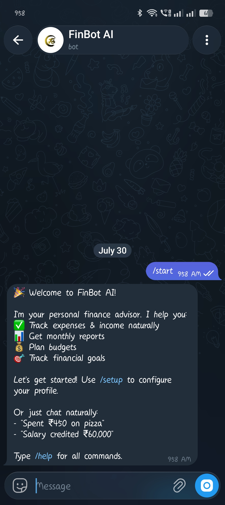

### Setup Profile
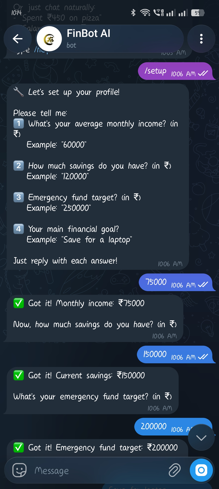
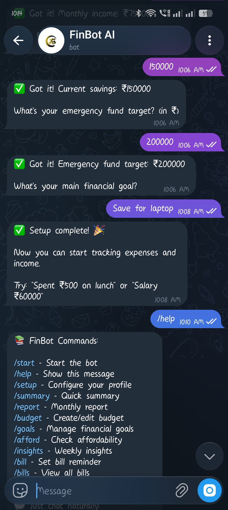

### Expense & Income Logging
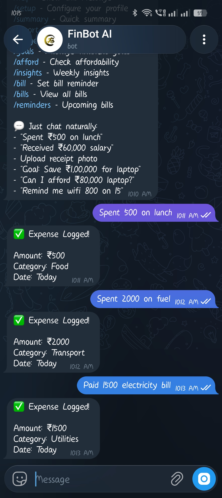

### Financial Goals
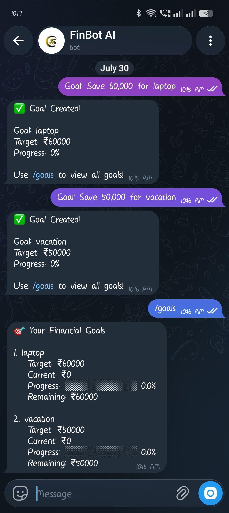

### Affordability Analysis
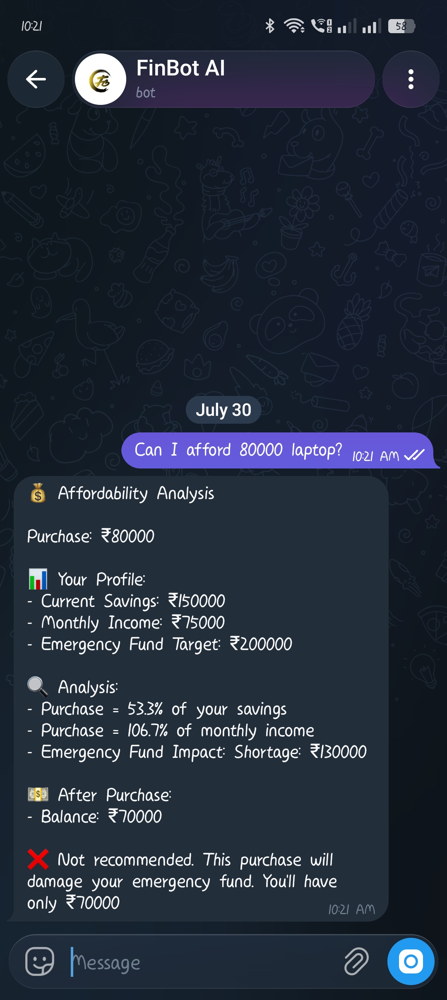

### Financial Summary
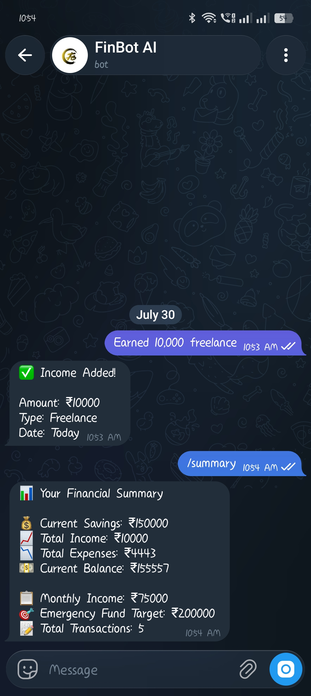

### Weekly Insights
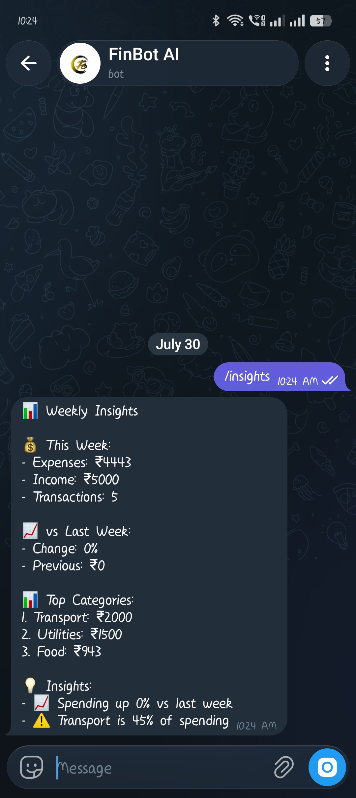

### Monthly Report
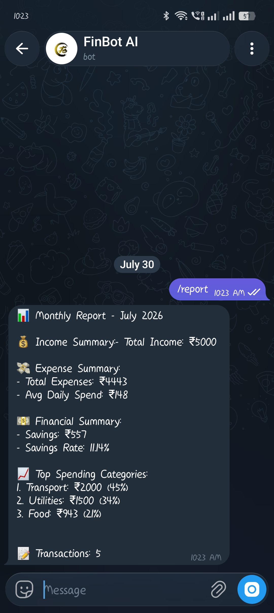

### Bill Reminders
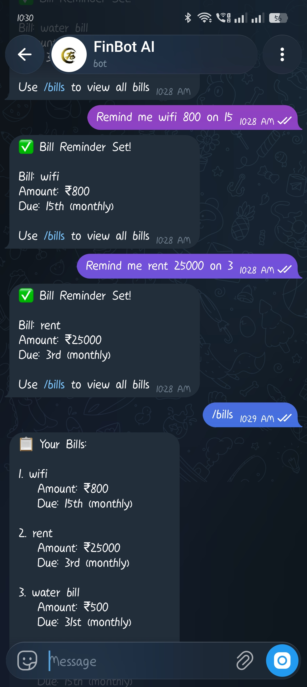

### Check Reminders
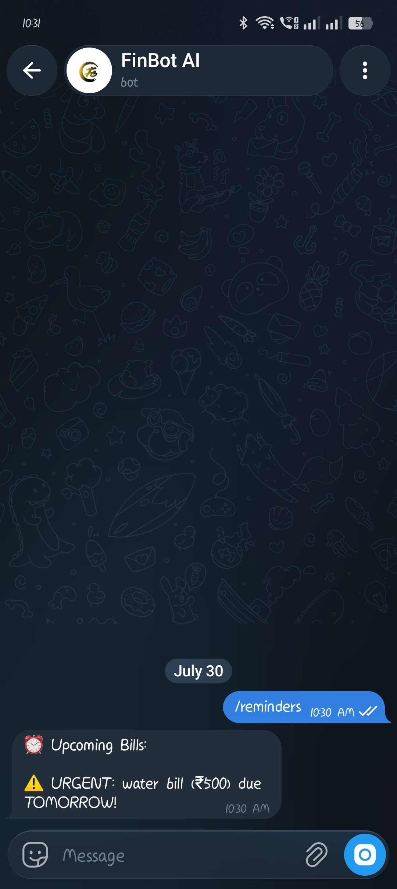

## Project Structure


```
finbot-ai/
├── backend/
│   ├── src/
│   │   ├── config/
│   │   │   └── database.js
│   │   ├── models/
│   │   │   ├── User.js
│   │   │   ├── Transaction.js
│   │   │   ├── Goal.js
│   │   │   └── Bill.js
│   │   ├── services/
│   │   │   ├── transactionService.js
│   │   │   ├── reportService.js
│   │   │   ├── budgetService.js
│   │   │   ├── goalService.js
│   │   │   ├── affordabilityService.js
│   │   │   ├── insightService.js
│   │   │   ├── receiptService.js
│   │   │   ├── billReminderService.js
│   │   │   ├── geminiService.js
│   │   │   └── huggingfaceService.js
│   │   ├── handlers/
│   │   │   ├── commandHandler.js
│   │   │   └── messageHandler.js
│   │   ├── utils/
│   │   │   ├── logger.js
│   │   │   └── helpers.js
│   │   └── index.js
│   ├── logs/
│   ├── temp/
│   ├── .env
│   ├── .gitignore
│   ├── package.json
│   └── README.md
│
├── screenshots/
├── README.md
└── .gitignore
```

## Commands

| Command | Description |
|---------|-------------|
| `/start` | Start bot |
| `/help` | Show commands |
| `/setup` | Configure profile |
| `/summary` | Financial summary |
| `/report` | Monthly report |
| `/budget` | Budget planning |
| `/goals` | Manage goals |
| `/afford` | Affordability check |
| `/insights` | Weekly insights |
| `/bill` | Set bill reminder |
| `/bills` | View bills |
| `/reminders` | Upcoming bills |


## Upload Receipt

Send receipt photo → Bot extracts amount → Confirms category → Auto-logs expense

## 👤 Developer

abhi0506